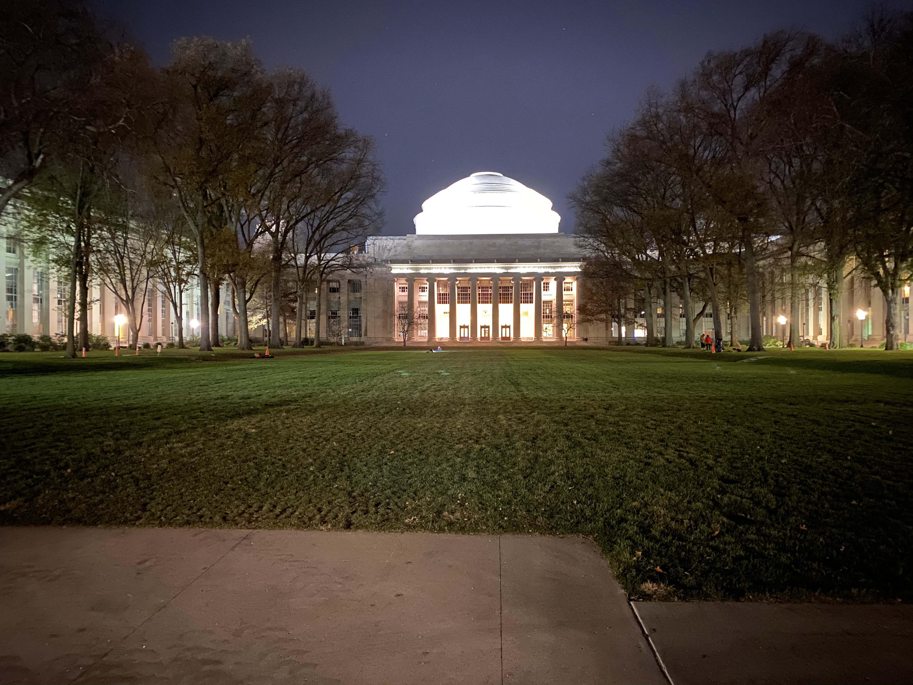

# **Welcome to my website!**

**Hello! My name is Braden Cook, and this is my website!**

I am currently a graduating senior at Massachusetts Institute of Technology
(MIT) studying Electrical Engineering and Computer Science with a humanities
concentration in Music! Here, on my website, I have displayed some neat 
projects and music compositions I have made during my time at MIT. 

Thanks for visiting my website! Special shoutout to my friend [Eric Boehlke](https://ericboehlke.com)
who helped me get my website up and running. If you would like to contact
me about anything on my website, feel free to send me an email at bncook@mit.edu.

<!--Also, check out some of my favorite photos from my time in Cambridge/Boston!-->

<!--section class="features">
    <figure> 
        
        <figcaption>Swans on the Charles River</figcaption>
    </figure>
    <figure>
        
        <figcaption>MIT Dome at Night</figcaption>
    </figure>
    <figure>
        
        <figcaption>Charles River and Boston Skyline</figcaption>
    </figure>
</section--> 

