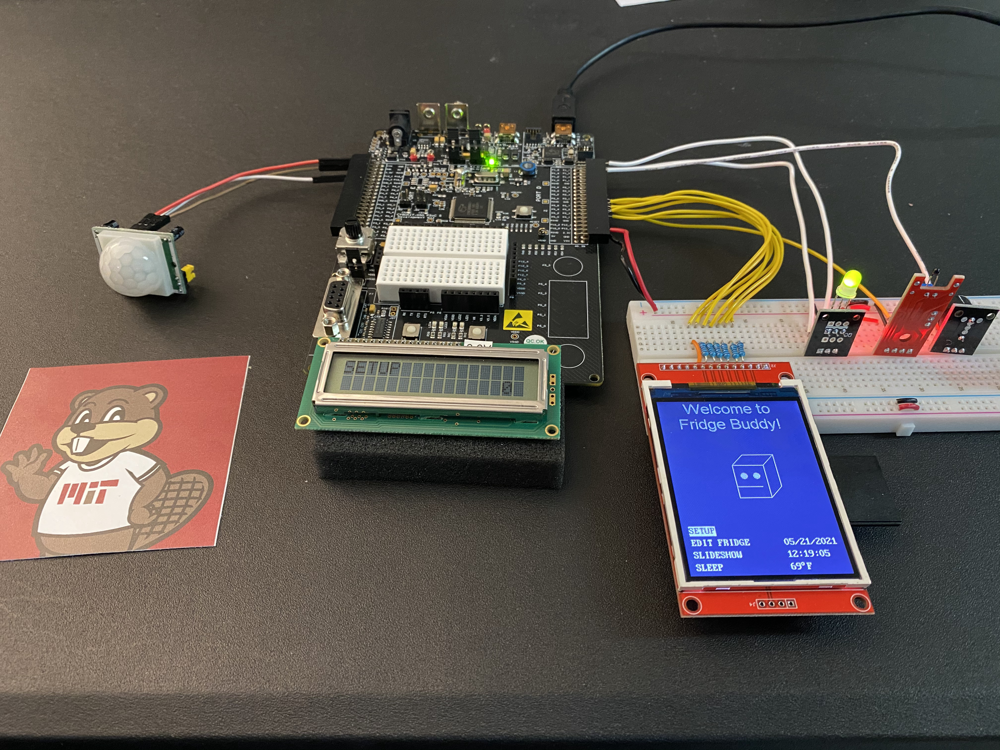
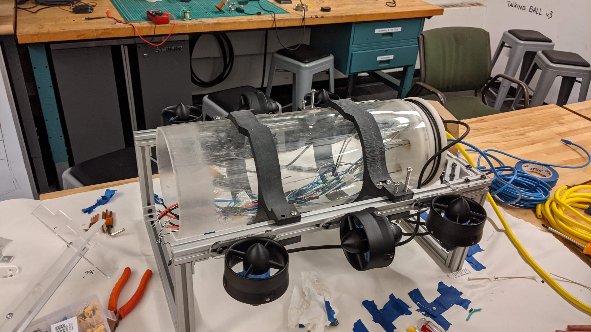
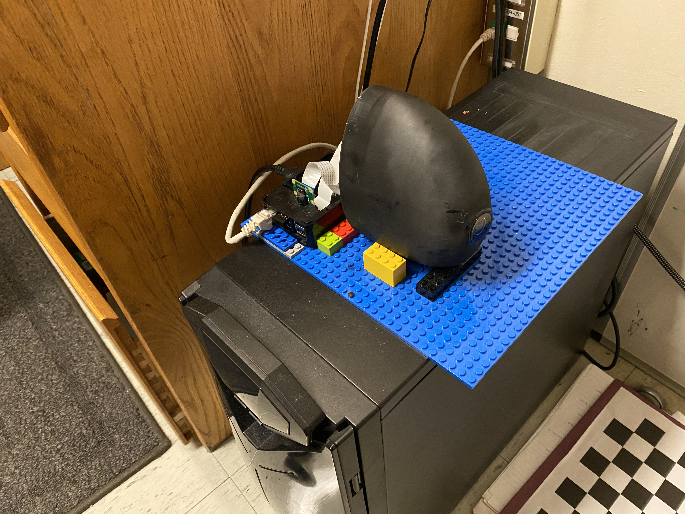

<h1 id="under_construction" style="text-align: center"><strong><i>This page is still under construction</i></strong> </h1> 

# Fridge Buddy - Final Project 6.115 (Microcomputer Project Lab)

# Designing an Autonomous Underwater Vehicle - MIT Marine Robotics Team

# SoFi, the Soft Robotic Fish - MIT CSAIL UROP

# Twin Propeller Angle Control  - Final Lab 6.302 (Feedback Control Systems)

<!--

# Proyecto Final (Spanish 1)

# Next Project! TBD...-->

